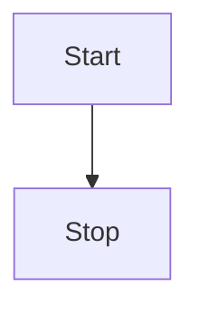

# Diagram Syntax 

Mermaid's syntax is used to create diagrams. You'll find that it is not too tricky and can be learned in a day. 

Syntax, together with Deployment and Configuration constitute the whole of Mermaid.

## Syntax Structure

One would notice that all **Diagrams definitions begin** with a declaration of the **diagram type**, followed by the definitions of the diagram and its contents. This declaration notifies the parser which kind of diagram the code is supposed to generate.

For apps that support markdown (e.g. GitHub, GitLab, Obsidian, etc.), you can add Mermaid diagrams by making a mermaid code block.

> The following code-block will be rendered as a Mermaid diagram:

To add a Mermaid diagram to a DevOps Wiki page, use the following syntax:
::: mermaid
flowchart LR
  A --> B
:::
