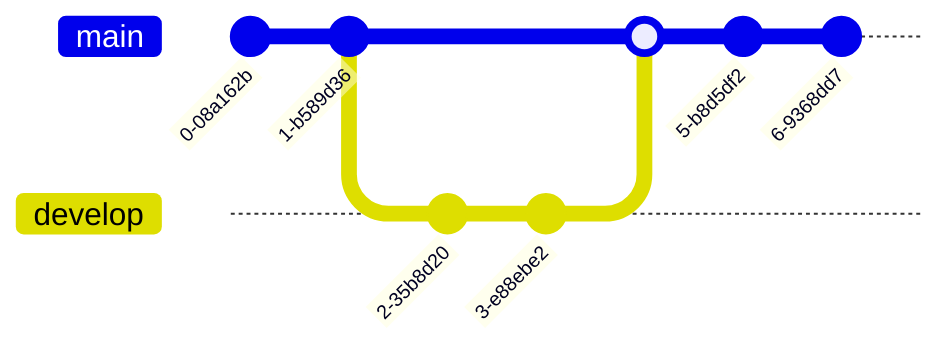

# Sample Syntax List

- [`Flowchart`](#Flowchart)
- [`Sequence`](#Sequence)
- [`Class`](#Class)
- [`State`](#State)
- [`Entity Relationship`](#ER)
- [`Gantt`](Gantt)
- [`Journey`](#Journey)
- [`Git`](#Git)
- [`Pie`](#Pie)
- [`Mind Map`](#MindMap)

# Flowchart

# Sequence

# Class

# State

# ER

# Journey

# Git

# Pie

# MindMap

